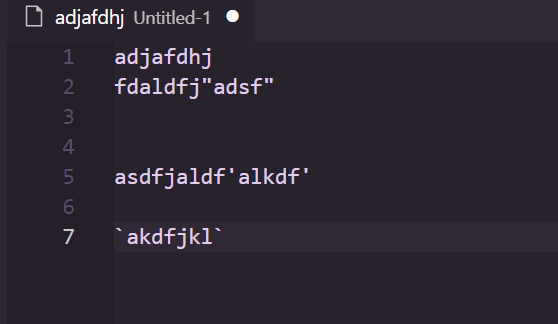

# 🚀 Code Helper - Visual Studio Code 插件

Code Helper 是一款方便的 Visual Studio Code 插件，旨在提高开发效率。它可以在粘贴时自动替换路径中的反斜杠(\\)为双反斜杠(\\\\)，同时还能够快速地将被引号包围的字符串中的引号替换为其他引号。
Code Helper is a convenient Visual Studio Code plugin designed to enhance development efficiency. It automatically replaces single backslashes (\\) with double backslashes (\\\\) when pasting paths and swiftly replaces quotes in strings enclosed by quotes with other quotes.

## 🛠️ 功能特点 Features

- **自动替换路径中的反斜杠**：在粘贴路径时，Code Helper 会自动将单个反斜杠替换为双反斜杠，使得路径符合特定的格式要求，`Ctrl + z` 可撤销。
- **Auto Replacement of Backslashes in Paths**: When pasting paths, Code Helper automatically replaces single backslashes with double backslashes, ensuring that the path adheres to specific format requirements. Ctrl + Z can be used to undo.

- **快速替换字符串引号**：选中被引号包围的字符串后，通过快捷键或命令，可以快速将字符串的引号替换为其他引号。例如，选中 `'123'`，按下双引号键，即可将字符串替换为 `"123"`，`Ctrl + z` 可撤销。
- **Quick Replacement of String Quotes**: After selecting a string enclosed by quotes, you can swiftly replace the quotes with other quotes using shortcut keys or commands. For example, selecting `'123'` and pressing the double quote key will replace the string with `"123"`. `Ctrl + Z` can be used to undo.

## 🚀 安装 Installation

在 Visual Studio Code 中搜索 `code helper`，点击安装即可使用。
Search for `code helper` in Visual Studio Code and click install to start using.

## 📝 使用方法 Usage

### 自动替换路径中的反斜杠 Auto Replacement of Backslashes in Paths

当你粘贴路径时，Code Helper 会自动检测路径中的反斜杠并进行替换。无需手动操作，即可让路径格式更加规范。
When pasting paths, Code Helper automatically detects backslashes in the path and performs replacements. No manual operation is required, making the path format more standardized.

### 快速替换字符串引号 Quick Replacement of String Quotes

1. 选中被引号包围的字符串。
2. 直接输入另一个引号。
3. 字符串的引号将会被替换为其他引号，根据你的选择。

1. Select the string enclosed by quotes.
2. Enter another quote directly.
3. The quotes of the string will be replaced with other quotes according to your selection.

## 🙌 反馈与贡献 Feedback and Contributions

如果你发现任何问题或者有任何建议，欢迎提交 Issue 或 Pull Request。你的反馈将会使 Code Helper 变得更加完善！
If you encounter any issues or have suggestions, feel free to submit an issue or pull request. Your feedback will help improve Code Helper!

## 📄 许可证 License

本项目采用 [MIT 许可证](./LICENSE) 开放源代码。
This project is licensed under the [MIT License](./LICENSE), making the source code open for use.

---

感谢您使用 Code Helper！愿您的开发过程更加顺畅和高效！ 🚀🔧
Thank you for using Code Helper! May your development process be smoother and more efficient! 🚀🔧
